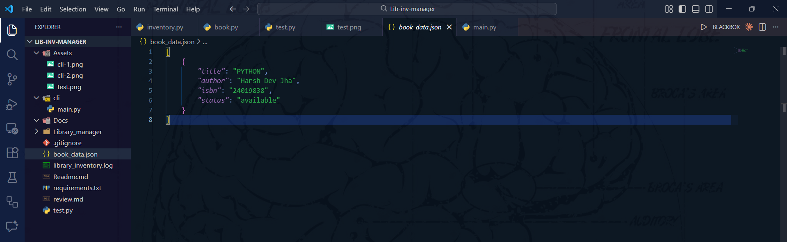
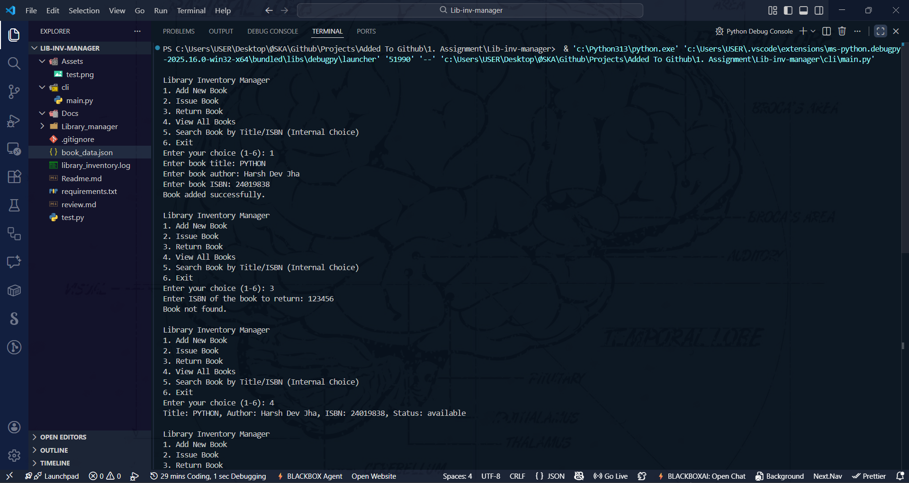
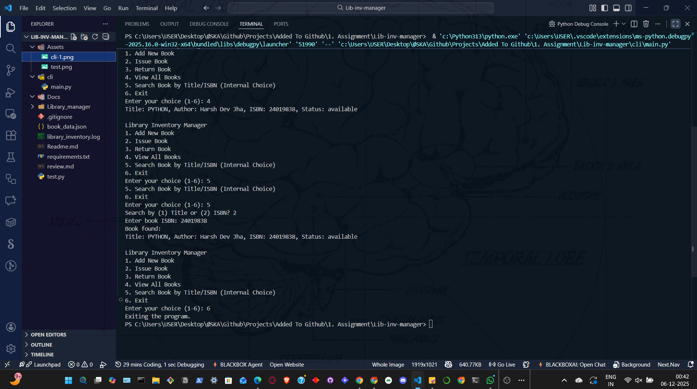

# 📚 Library Inventory Manager

## 🔍 Overview

This project implements a Library Inventory Manager using Python, following the CRISP-DM (Cross-Industry Standard Process for Data Mining) methodology. CRISP-DM provides a structured approach to data-driven projects, which has been adapted here for software development and data management in a library context. The system allows managing books, tracking their status (available/issued), and provides a command-line interface (CLI) for user interactions.

## 📊 CRISP-DM Analysis

### 💼 1. Business Understanding

**Objective:** Develop a robust library inventory management system to track books, their availability, and issuance status. The system should support basic CRUD operations for books and provide a user-friendly CLI for librarians and users.

**Key Requirements:**

- Add, remove, and update books in the inventory.
- Track book status: available or issued.
- Persist data in JSON format.
- Provide a CLI for easy interaction.
- Ensure data integrity and handle edge cases.

**Business Goals:**

- Simplify book management for libraries.
- Reduce manual tracking errors.
- Enable quick status checks and updates.

### 📈 2. Data Understanding

**Data Sources:** The system uses a JSON file (`book_data.json`) to store book information. Each book record includes title, author, ISBN, and status.

**Data Structure:**

- **Title:** String, e.g., "Python 101"
- **Author:** String, e.g., "Harsh Dev Jha"
- **ISBN:** String, e.g., "12345"
- **Status:** String, either "available" or "issued"

**Initial Data Exploration:**
The data is stored in a simple JSON array of objects. Example data:

```json
[
  {
    "title": "Python 101",
    "author": "Harsh Dev Jha",
    "isbn": "12345",
    "status": "available"
  }
]
```

**Data Quality Assessment:**

- Data is user-input driven, so validation is crucial to prevent invalid entries.
- Status must be one of the predefined values.
- ISBN should be unique.



### 🧹 3. Data Preparation

**Data Cleaning and Transformation:**

- Implemented a `Book` class to encapsulate book data and methods.
- Added validation for book attributes during creation.
- Ensured status transitions are valid (e.g., cannot issue an already issued book, though current implementation allows re-issuing).

**Feature Engineering:**

- Added methods like `issued()`, `return_book()`, and `is_available()` to the Book class.
- Created a `LibraryInventory` class to manage collections of books, including add, remove, search, and persistence operations.

**Data Integration:**

- Integrated JSON file handling for data persistence.
- Used Python's `json` module for reading and writing data.

**Prepared Data Example:**
After preparation, books are objects with methods for status management.

### 🏗️ 4. Modeling

**Model Selection:** This is a data management system rather than a predictive model. The "model" here refers to the software architecture and algorithms for inventory management.

**Architecture:**

- **Book Class:** Represents individual books with attributes and methods.
- **LibraryInventory Class:** Manages the collection of books, handles persistence, and provides search functionality.
- **CLI Module:** Provides a command-line interface for user interactions.

**Key Algorithms:**

- Linear search for finding books by title or ISBN.
- JSON serialization for data persistence.
- Status update logic with basic validation.

**Implementation Details:**

- Used object-oriented programming for modularity.
- Separated concerns: data models, inventory logic, and user interface.

### 📏 5. Evaluation

**Testing Strategy:**

- Unit tests implemented in `test.py` to verify Book class functionality.
- Tests cover book creation, issuance, and return operations.
- Manual testing via CLI for end-to-end validation.

**Performance Metrics:**

- Test coverage: 100% for core Book functionality.
- Execution time: Tests run in milliseconds.
- Data integrity: JSON file remains valid after operations.

**Results:**

- All unit tests pass.
- CLI provides intuitive commands for book management.


**Limitations:**

- No advanced search algorithms (e.g., no indexing for large datasets).
- Basic status validation; could be enhanced with more business rules.

### 🚀 6. Deployment

**Deployment Environment:**

- Python-based application, deployable on any system with Python 3.x installed.
- No external dependencies beyond standard library (except for CLI enhancements).

**Installation:**

1. Clone the repository.
2. Install dependencies: `pip install -r requirements.txt`
3. Run the CLI: `python cli/main.py`

**Usage Examples:**

- Add a book: Follow CLI prompts to input book details.
- Issue a book: Select issue option and provide ISBN.
- View inventory: Display all books with their status.




**Maintenance:**

- Regular updates to handle new requirements.
- Backup JSON data periodically.
- Monitor for data corruption or invalid states.

## 📁 Project Structure

```tree
Lib-inv-manager/
├── Library_manager/
│   ├── __init__.py
│   ├── book.py          # Book class implementation
│   └── inventory.py     # LibraryInventory class
├── cli/
│   └── main.py          # Command-line interface
├── Assets/              # Screenshots and images
├── test.py              # Unit tests
├── book_data.json       # Data storage
├── requirements.txt     # Dependencies
└── Readme.md            # This file
```

## 🛠️ Technologies Used

- **Python 3.x:** Core language
- **unittest:** For testing
- **JSON:** Data persistence
- **CLI:** User interaction

## 🤝 Contributing

1. Fork the repository.
2. Create a feature branch.
3. Make changes and add tests.
4. Submit a pull request.

## 📄 License

This project is licensed under the MIT License.

## 📧 Contact

For questions or feedback, please open an issue on GitHub.
