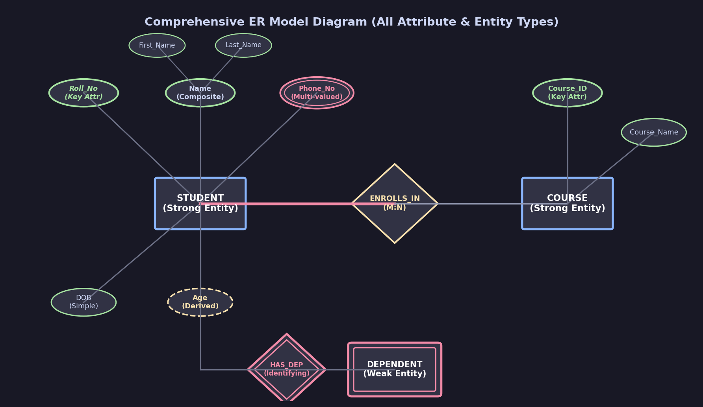
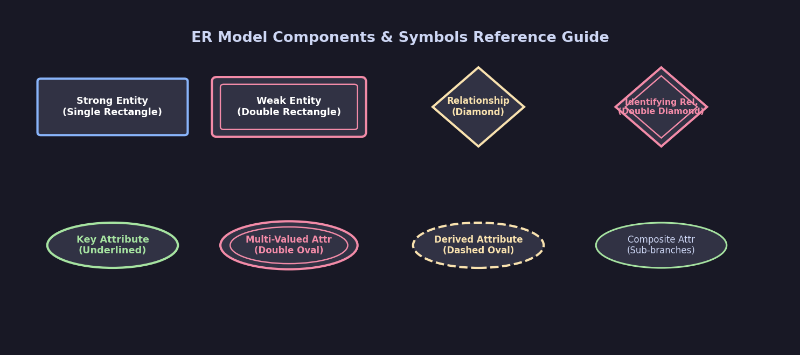
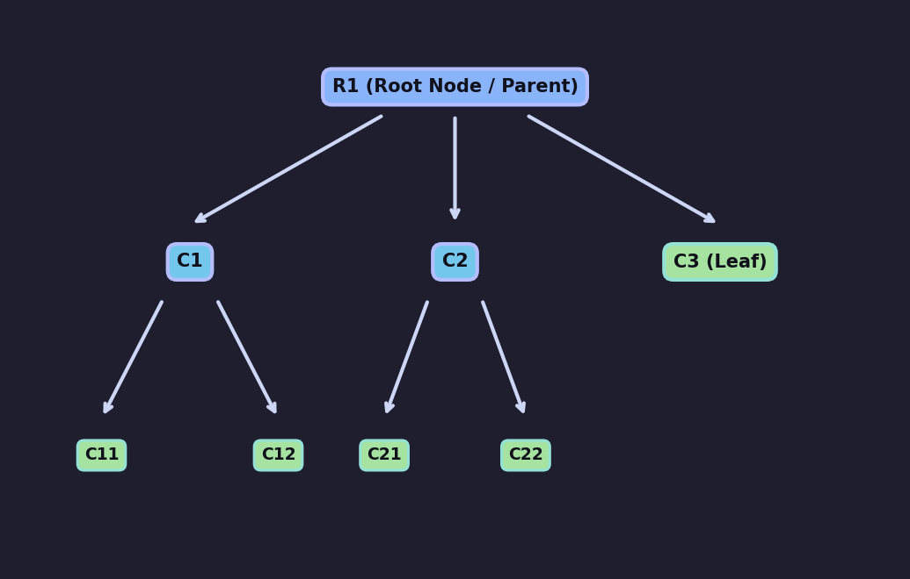
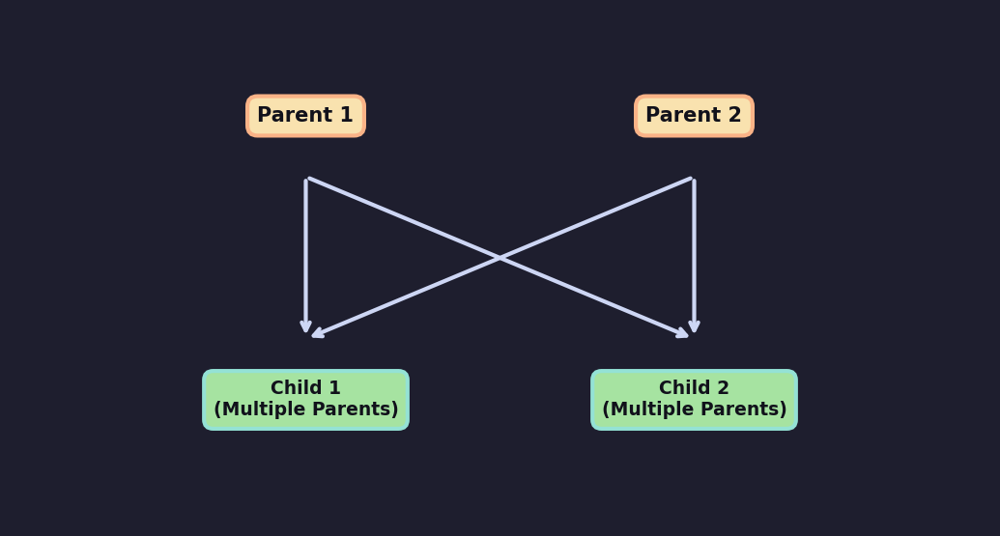

# Class-Notez

## 04-08-2026

### Data

    Data - It is raw unprocessed facts or figures , It has no context or meaning on its own.
        Example - A list of transaction amount ; 100 ,200 ,300 ,500 etc.

### Information

    Information - It is the data that has been processed, organised or structured to make it meaninigful.
        Example - Avg marks of students in class is 86.6 , and topper scored 92.

### Database

    Database - A database is an organised collection of structured information, or data, typically stored electronically in a computer system, that can be easily accessed managed and updated.
    It represents data in a structured way to reduce redundancy and is easy to retrieve, retrieve, inser, update and delete the data / information.
    A database is usually controlled by a database management system (DBMS).
    Example of a database : Customer details, Product information, Sales records etc.
        A schools database stores information about students,teachers, courses, and grades in organized interlinked way.

    Advantages: 
        1. Searching is made easier by using only queries instead of the alr used program in file-based systems, i.e. file handling.
        2. Data is easily accessible, manageable, and updated.

### DBMS

    DBMS - A Database Management System (DBMS) is a software application that allows users to create and manage databases.
    It provides a user-friendly interface between database and its users for performing various database operations such as creating tables, inserting, updating, deleting, and retrieving data.
    It allows users to create, read, update and delete teh Data in the Database.
    DBMS also provides features such as security, concurrency control, backup and recovery, and data integrity.
    Example of a DBMS : MySQL, Oracle, SQL Server, PostgreSQL, etc.
    Its what IDE is to programming in this case what database is to DBMS.

### File system

    Before DBMS came into use traditional File processing system were in use, where each application had its own separate file and its version to store data and access them , updation became a headache.
    Disadvantage:
         1. Data redundancy and Inconsistency (Incorrect Version, Updation Issues)
            Different application maintaining their own files , same data eg student name or address , often they got duplicated across multiple files . This wasteed stograe space leads to 'Inconsistency' . If data was updated for one file and not other , conflicting values would exist.
        2. Difficulty in Accessing Data
            To retrieve data in a file system , you had to write custom code (Program) for each type of query.
            If you needed student marks , you wrote a program. If you needed course info , another program.Makign it very Time consuming.
        3. Data Isolation
            Data is Scattered in differnet files, often different formats, making it hard to retrieve data from multipel sources.
        4. Integrity Problems (Validation Not Performed)
            Data values have to satisty certain 'Consistency Constraints' eg: account balance must not go below zero, Enforcing these constraints was difficult.Enforcing these contrains require additional coding to every application program, especially when constraint change.
        5. Atomicity Problems
            A computer system like an device is subject to failute , If a failure occures duing a transaction 
            e.g. bank transfer, it must be ensures that either `all` operations are completeed, or `none` are , to keep data consistent. File systems couldn't guarantee this.

            Transaction Between A and B 
            if A has initial 1000 . it debits 500 then its balance is not 500 but i wont `Commit` it as A doesnt have enough balance.Creating a failure situation thus i wouldnt be able to follow with the situation where B which has 0 iniital balance would be Credited 500 balance from A  and increase it Balance to 500 thus i cant commit it.
            In this case for A `Rollback` and for B `No Change` would happen.
            Atomicity in DBMS ensures that even if failure occurs, the data remains consistent by either completing all operations or none at all.

        6. Concurrent Access Anomalies 
            Multiple Users accessing same data simultaneously leads to uncontrolled overwrites and irratic results, and inconsistent data eg two people booking the same seat at same time.
        

## 05-08-2026

### ER Model (Entity-Relationship Model)

    The Entity-Relationship (ER) Model is a high-level conceptual data model used to design relational database schemas. 
    It views a real-world system as a collection of basic objects called entities and relationships among these objects.

---

### Core Components & Detailed Attribute Implementations

#### 1. Entities & Entity Sets
- **Entity**: A real-world object or concept that is uniquely distinguishable (e.g., a specific Student, Car, Course).
- **Entity Set**: A collection of similar entities sharing the same properties (e.g., all `STUDENT` entities in a university).
- **Strong Entity Set**: An entity set that possesses a primary key attribute to uniquely identify each tuple. (Notation: Single Rectangle)
- **Weak Entity Set**: An entity set that does not have a primary key on its own and relies on a strong identifying entity set. It uses a **Partial Key / Discriminator** (Notation: Double Rectangle).

#### 2. Attribute Types & Implementation
Attributes are characteristics or properties that describe an entity set.

| Attribute Type | Description | Diagrammatic Notation | Real-World Example |
| :--- | :--- | :--- | :--- |
| **Key Attribute** | Uniquely identifies an entity instance within an entity set. | Oval with <u>Underlined Text</u> | `Roll_No`, `SSN`, `Employee_ID` |
| **Simple / Atomic Attribute** | Cannot be divided into further sub-components. | Standard Oval | `Gender`, `Salary` |
| **Composite Attribute** | Can be divided into smaller sub-parts that form meaningful hierarchy. | Oval connected to Sub-Ovals | `Name` $\rightarrow$ (`First_Name`, `Last_Name`) `Address` $\rightarrow$ (`Street`, `City`, `State`, `Pincode`) |
| **Single-Valued Attribute** | Holds exactly one value for an entity instance. | Standard Oval | `DOB`, `Date_of_Joining` |
| **Multi-Valued Attribute** | Can hold multiple values for a single entity instance simultaneously. | Double Oval / Double Ring | `Phone_Numbers`, `Email_Addresses`, `Degrees` |
| **Derived Attribute** | Dynamically computed/derived from another attribute or current system date. | Dashed Oval | `Age` (derived from `DOB` & current date) `Total_Price` (derived from `Price * Qty`) |

#### 3. Relationships & Constraints
- **Relationship Set**: An association between two or more entity sets (Notation: Diamond).
- **Identifying Relationship Set**: Links a weak entity set to its strong owner entity set (Notation: Double Diamond).
- **Cardinality Ratios**:
  - **One-to-One (1:1)**: e.g., One Department has One Head of Dept (HOD).
  - **One-to-Many (1:N)**: e.g., One Department employs Many Professors.
  - **Many-to-One (N:1)**: e.g., Many Students belong to One Department.
  - **Many-to-Many (M:N)**: e.g., Many Students enroll in Many Courses.
- **Participation Constraints**:
  - **Total Participation (Existence Dependency)**: Every entity instance must participate in the relationship (Notation: Double Line).
  - **Partial Participation**: Some entity instances may not participate in the relationship (Notation: Single Line).

---

### Visual ER Diagrams & Symbol References

#### Complete ER Diagram (Featuring All Attribute & Entity Types)

#### ER Notation Symbols Reference Guide

---

## 06-08-2026

### Disadvantages of File System (Continued)

        5. Atomicity Problems (Errors / Problems)

        6. Concurrent Access Anomalies:
            When multiple users access & update data simultaneously, uncontrolled concurrent access can lead to inconsistent data.
            (Example: Two people booking the same seat at the same time).
            (Record level locking is not allowed in file system).

        7. Security Problems:
            Not every user should have access to all data. File systems made it difficult to enforce security constraints since application programs were added to the system in an ad-hoc manner, without centralized control.

        8. Lack of Data Independence:
            Any change in the file system structure (Example: adding a field) required modifying all the application programs that accessed that file, since data organization was tightly bound to the program logic.

---

### Data Model Architecture

    Data Model:
        - A DBMS needs a structured way to describe data at the conceptual level.
          [Ek mechanism jisme conceptual level par data store karta hai]
        - A Data Model is a collection of concepts, notations, and tools that describe:
            (1) Structure - What data looks like (tables, fields, data types).
            (2) Operations - Actions performed on data (insert, update, delete, query).
            (3) Constraints - Rules enforcing consistency and integrity.

#### 1. Hierarchical Data Model Structure (Tree Graph)
Organizes records in a inverted tree-like parent-child structure ($1:N$).

    Structure Details:
        - Root Node: R1 (Only 1 root node per tree)
        - Parent / Child Relationship: Every child has exactly ONE parent.
        - Leaf Nodes: C3, C11, C12, C21, C22
        - Siblings: C1, C2, C3
        - Cardinality: 1:N (One to Many)

#### 2. Network Data Model Structure (Graph Model)
Extends the hierarchical model by allowing a child record to have multiple parent records ($M:N$).

---

### In-Depth Implementation & Comparison Matrices (Differences Tables)

#### Comparison 1: File Processing System vs. Database Management System (DBMS)

| Feature / Metric | File Processing System | DBMS (Database Management System) |
| :--- | :--- | :--- |
| **Data Redundancy** | High — same data duplicated across multiple application files. | Minimal — centralized data storage reduces duplication. |
| **Data Consistency** | Low — updating one file leaves old versions in other files. | High — single updates propagate across all views. |
| **Data Independence** | Absent — file layout changes require updating application code. | Present — Logical & Physical data independence supported. |
| **Concurrency Control** | Poor — no record-level locking leading to race conditions. | Advanced — ACID transactions & concurrency control protocols. |
| **Data Access** | Custom file-handling code required for every query. | Standard declarative Query Languages (e.g., SQL). |
| **Security & Auditing** | Difficult — ad-hoc access without centralized role checks. | Enforced — Role-Based Access Control (RBAC) & audit logs. |

---

#### Comparison 2: Detailed Comparison of Data Models

| Aspect | Hierarchical Model | Network Model | Relational Model (RDBMS) | Entity-Relationship (ER) Model |
| :--- | :--- | :--- | :--- | :--- |
| **Data Structure** | Tree structure (Parent-Child) | Graph structure (Sets & Record types) | 2D Tables (Relations: Rows & Columns) | Conceptual Diagram (Entities & Relationships) |
| **Parent-Child Link** | Strictly 1 Parent per Child | Multiple Parents allowed per Child | Foreign Key constraints | Relationships & Mapping Cardinalities |
| **Supported Cardinality** | $1:1$, $1:N$ | $1:1$, $1:N$, $M:N$ | $1:1$, $1:N$, $N:1$, $M:N$ | $1:1$, $1:N$, $N:1$, $M:N$ |
| **Flexibility** | Rigid | Moderate | Extremely Flexible | High (Conceptual Design Level) |
| **Query Complexity** | Navigation paths hardcoded | Pointers & record sets required | Simple SQL queries | N/A (Used for Schema Design) |
| **Data Independence** | Low | Low | High | High |
| **Historical Example** | IBM IMS | CODASYL DBTG | MySQL, PostgreSQL, Oracle | Conceptual System Modeling |

---

#### Comparison 3: Strong Entity Set vs. Weak Entity Set

| Metric / Aspect | Strong Entity Set | Weak Entity Set |
| :--- | :--- | :--- |
| **Primary Key** | Contains a unique Primary Key attribute. | Lacks a primary key; has only a Partial Key (Discriminator). |
| **Dependency** | Independent of other entity sets. | Existence Dependent on a Strong Owner Entity Set. |
| **Diagram Notation** | Single Rectangle | Double Rectangle |
| **Relationship Link** | Connected via Standard Relationship (Single Diamond). | Connected via Identifying Relationship (Double Diamond). |
| **Participation** | Can have Partial or Total Participation. | Always has Total Participation in its Identifying Relationship. |
| **Example** | `STUDENT` with key `Roll_No` | `DEPENDENT` with partial key `Dependent_Name` |

---

#### Comparison 4: Attribute Types Comparison Matrix

| Attribute Type | Can be Subdivided? | Number of Values | Derived / Stored? | Visual Notation | Key Use-Case |
| :--- | :--- | :--- | :--- | :--- | :--- |
| **Key Attribute** | No | 1 (Unique) | Stored | Oval with <u>Underline</u> | Primary Key identification (`Roll_No`) |
| **Simple Attribute** | No (Atomic) | 1 | Stored | Standard Oval | Single properties (`Gender`, `Salary`) |
| **Composite Attribute** | Yes (Hierarchy) | 1 (Combined) | Stored | Oval with Sub-branches | Complex fields (`Name`, `Address`) |
| **Multi-Valued Attribute**| No | Multiple ($\ge 0$) | Stored | Double Oval | Collections (`Phone_No`, `Skills`) |
| **Derived Attribute** | No | 1 | Calculated | Dashed Oval | Dynamic values (`Age` from `DOB`) |

---

#### Comparison 5: Total Participation vs. Partial Participation

| Feature | Total Participation | Partial Participation |
| :--- | :--- | :--- |
| **Definition** | Every entity in the set MUST participate in at least one relationship instance. | Not all entities in the set are required to participate in a relationship. |
| **Dependency** | Indicates Existence Dependency. | Indicates optional relationship association. |
| **Notation** | Double Line | Single Line |
| **Example** | Every `LOAN` must belong to at least one `CUSTOMER`. | Not every `CUSTOMER` must take a `LOAN`. |
